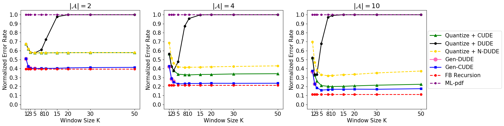
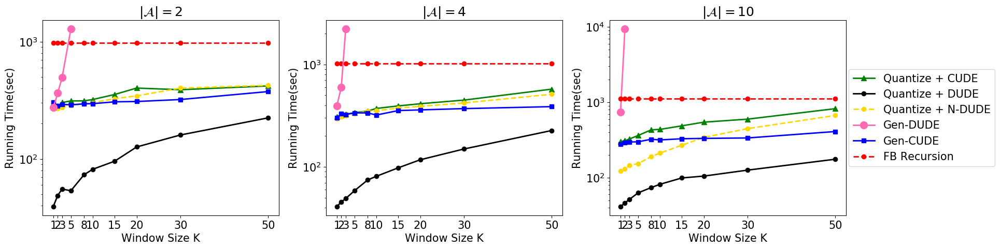

# Gen-CUDE
* is an unsupervised, universal context-based denoiser 

* Code accompanying the paper "Unsupervised Neural Universal Denoiser for Finite-Input General-Output Noisy Channel" (https://arxiv.org/abs/2003.02623)

* Proceedings of the 23rd International Conference on Artificial Intelligence and Statistics (AISTATS) 2020, Palermo, Italy. PMLR: Volume 108. Copyright 2020 by the author(s).


# Experimental environments
* Python 3.6.6
* CUDA v9.2
* Tensorflow v1.15.0
* Keras v2.2.4


# Results




# Citation
```
@misc{park2020unsupervised,
    title={Unsupervised Neural Universal Denoiser for Finite-Input General-Output Noisy Channel},
    author={Tae-Eon Park and Taesup Moon},
    year={2020},
    eprint={2003.02623},
    archivePrefix={arXiv},
    primaryClass={cs.IT}
}
```
